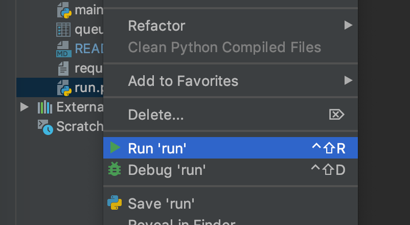

# How to run the web app using run.py

The best way to run the web app is using the `run.py` file. There are two ways to do it:

### A) Right-click in PyCharm on the `run.py` file and select Run.

### B) Run in the terminal using `python run.py` (make sure you use Python 3).

The `run.py` script will ask you whether to run the web app or tests.

Alternatively, you can select app vs. tests already in the command line:

    python run.py app

or

    python run.py test

## IMPORTANT: auto reloading

When you make a change in any Python file, the Flask app will automatically reload so that the changes are recognized.

But unfortunately, this auto reloading only works for Python files, not for other files such as HTML, CSS, JS etc.

So how to solve this problem?

When you make a change in the HTML file, also make a simple space in the main.py file (or some other Python file). You 
can make the space after this line:

    app = Flask(__name__)

The space itself is harmless and it will not hurt your web app. After you make it, save the changes (CTRL+S or CMD+S) 
and the web app will automatically reload.

You are able to see that the web app has reloaded if you see this line popping up in the terminal:

     * Restarting with stat

## Links:

- [Index](/README.md#documentation)
- [Tests - how to run them](tests.md)
